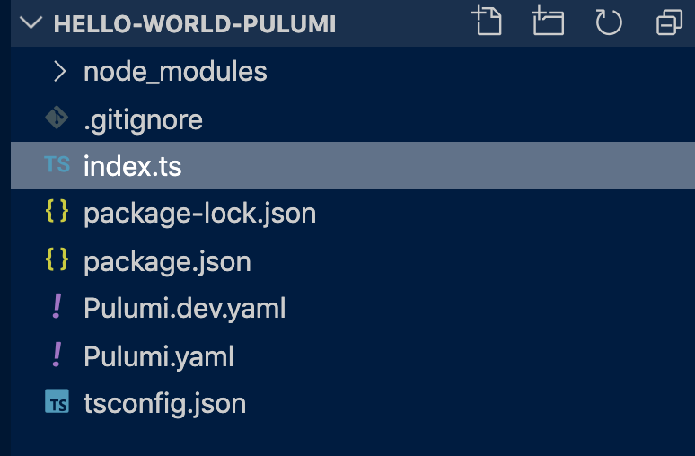
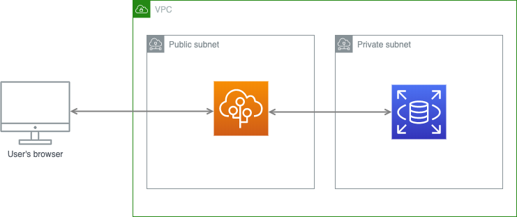
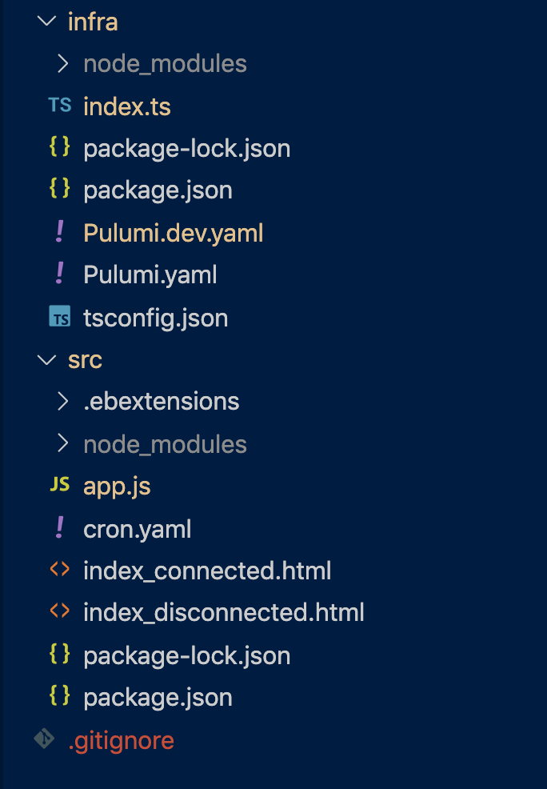

## Introduction 

This post covers the following topics:

- Introduction to Infrastructure as Code
- Using Pulumi to automate the deployment
- Hello world of Infrastructure as Code (IaC) with Pulumi
- Advanced example: Creating a secure deployment of AWS RDS and Elastic Beanstalk with Pulumi

## Introduction to Infrastructure as Code
IAC or infrastructure as code is getting a lot of attention recently amongst DevOps teams. 

Definition of Infrastructure as Code according to [https://en.wikipedia.org/wiki/Infrastructure_as_code](Wikipedia):

_Infrastructure as code (IaC) is the process of managing and provisioning computer data centres through machine-readable definition files, rather than physical hardware configuration or interactive configuration tools. The IT infrastructure managed by this comprises both physical types of equipment such as bare-metal servers as well as virtual machines and associated configuration resources. The definitions may be in a version control system. It can use either scripts or declarative definitions, rather than manual processes, but the term is more often used to promote declarative approaches._

### Benefits of Infrastructure as Code
- Stored in repository along with your application
- Traceable, changes can be tracked in the same manner as code via commit history and logs
- Easy to reason (<-- not sure what you mean here as it sounds very subjective)
- Empowers DevOps teams
- In-sync with your application


### Different types of IaC
#### Declarative:
In declarative IaC techniques, you define *what* you want as infrastructure, you declare end-result state in a DSL (Domain Specific Language) or even in a popular programming language like Javascript. In other words, you declare the desired state of your environment and the framework/tool you are using creates the environment to fulfil the desired state.

#### Imperative:
With the imperative IaC approach, you define *how* you want to create your infrastructure. You breakdown the end-result into instructions using scripting languages or similar approaches which then create your infrastructure.

#### Intelligent:
The intelligent approach determines the desired state of the system and determines what needs to change before applying changes.
>_Environment aware desired state is the next generation of IaC._


## Pulumi
According to Pulumi web site:

>_Pulumi is a modern infrastructure as code platform. It includes a CLI, runtime, libraries, and a hosted service that, working together, deliver a robust way of provisioning, updating, and managing cloud infrastructure. Instead of YAML or a domain-specific language (DSL), Pulumi leverages existing, familiar programming languages, including TypeScript, JavaScript, Python, Go, and .NET, and their native tools, libraries, and package managers._

In terms of categories of infrastructure as code, Pulumi falls into *Declarative* category. You can declare the state of your cloud stack in your preferred language, Pulumi analyzes the current state of the environment, determines differences and prepare a set of instructions which transform the current state of your environment to the desired state. 

Pulumi currently supports four runtime and multiple languages on those runtimes. For more information, please see [Languages](https://www.pulumi.com/docs/intro/languages/)

- **Node.js** - JavaScript, TypeScript, or any other Node.js compatible language
- **Python** - Python 3.6 or greater
- **.NET Core** - C#, F#, and Visual Basic on .NET Core 3.1 or greater
- **Go** - statically compiled Go binaries

### Key features and differences of Pulumi:

- Since we are using an existing language, we can use techniques in that language or ecosystem of the language for abstraction, code reuse, and defining modules.
- No need to learn a new custom language defined by an IaC framework. For example, if you want to use (https://www.terraform.io/)[Terraform], you need to learn new domain-specific-language (DSL) defined by HashiCorp.
- Pulumi figures out dependencies and manages concurrency. For example, when the ID of a resource is used in another resource, Pulumi automatically waits for the creation of the first resource to acquire values required by the other resource and then attempt to create the other resource.
- Most cloud providers have their definition of IaC. This can be in the form of JSON or YAML files which can often result in big bloated files that are hard to read and difficult to reason about your code. However, Pulumi's code is in your preferred language, which is much more familiar and therefore readable than the native option.

Pulumi is actually a command-line tool (CLI) and some libraries in different languages supported by Pulumi. Pulumi also has a paid subscription-based platform which provides additional services. For example, features like continuous integration and continuous deployment, CrossGuard Policy as code, Security and additional support.

However, you can still use CLI tool which is free  and successfully set up your infrastructure as code using you ???????? <-- Missing? 


## Hello world of IaC with Pulumi
I want to go through setting up Pulumi and creating your first stack by what I call "Hello world of IaC with Pulumi". 
"Hello world" of IaC is going to be something as simple as creating blob storage in your preferred cloud provider platform with your preferred runtime and language. In this post, I am going to create my stack (Blob storage) on AWS and also use Node.js runtime with typescript.

### Setup Pulumi

If you are using MACOS, you can use Homebrew to install Pulumi. To install Pulumi on other platforms, you can check [Install Pulumi](https://www.pulumi.com/docs/get-started/aws/install-pulumi/) 

```bash
$ brew install pulumi
```

### Login to Pulumi service:
To manage your stack, you need to initialise your Pulumi CLI that sets up storage service which is used to manage your stack's state. Pulumi uses this Service/Storage to keep your current state and history of changes to your stack. So each successful update to your stack by Pulumi also updates this storage to keep track of your stack's changes.
There are many options you can use to initialise the Pulumi stack.

- Local storage
- Pulumi SaaS (subscription-based, Software as a Service)
- Cloud blob storage (AWS s3, Azure Blob Storage)

In this example, we use AWS S3 bucket as state storage for Pulumi. To login to the storage, you need to [install AWS CLI](https://docs.aws.amazon.com/cli/latest/userguide/cli-chap-install.html) [generate an Access Key](https://docs.aws.amazon.com/IAM/latest/UserGuide/id_credentials_access-keys.html#Using_CreateAccessKey) and [configure your AWS CLI](https://docs.aws.amazon.com/cli/latest/userguide/cli-chap-configure.html#cli-quick-configuration) to use that Access Key to communicate with AWS account 

Using a terminal, create the pulumi state bucket 


``` bash
$ aws s3api create-bucket --bucket pulumi-infra-bucket --region ap-southeast-2 --create-bucket-configuration LocationConstraint=ap-southeast-2
```

```
$ pulumi login s3://pulumi-infra-bucket
```

Make sure Node.js is installed on your system

``` bash
$ mkdir hello-world-pulumi && cd hello-world-pulumi
$ pulumi new aws-typescript
```


``` 
project name: (hello-world-pulumi)
project description: (A minimal AWS TypeScript Pulumi program)
Created project 'hello-world-pulumi'

stack name: (dev)
Enter your passphrase to protect config/secrets:
Re-enter your passphrase to confirm:
Created stack 'dev'

Enter your passphrase to unlock config/secrets
    (set PULUMI_CONFIG_PASSPHRASE to remember):
aws:region: The AWS region to deploy into: (us-east-1) ap-southeast-2
Saved config

Installing dependencies...
.
.
.
```

This step could take some time as Pulumi is installing all npm packages and plugins.

In the meantime, we can have a look at what pulumi has created as source code. The folder structure looks like the following image:



Inside this folder, there is `index.ts` file which is the primary source code for Pulumi. There is also `package.json` which is npm package file. There are two YAML file called `Pulumi.yaml` and `Pulumi.dev.yaml` the first file is the general configuration file for Pulumi. Configurations like `name`, `runtime` and `description`. The other YAML file is per environment. Depending on the number of environments you have you'll have multiple `Pulumi.*.yaml` files. Currently we only have one environment in the project which is dev therefore we have `Pulumi.dev.yaml`. These YAML files are defining the configuration per environment. 

```  yaml
encryptionsalt: <ENCRYPTIONSALT>
config:
  aws:region: ap-southeast-2
```

In this example, it has `aws:region` defined for the dev environment as `ap-southeast-2`. 

These are the main files for the quick hello world example out-of-the-box. But let's have a look in the main file `index.ts` and see what this sample is building.


``` typescript
import * as aws from "@pulumi/aws";

// Create an AWS resource (S3 Bucket)
const bucket = new aws.s3.Bucket("my-bucket-123");

// Export the name of the bucket
export const bucketName = bucket.id;

```

There are only three lines of code here. The first line is importing pulumi/aws package and alias as `aws`. The next line is using this API to create a new S3 bucket called `my-bucket-123`. The last line exports the name of the bucket. 


Now the initial setup of this sample is done, and we know what it is going to build, let's run this in our connected AWS account and see the result. To run this, you can use the CLI tool and run the following command.

``` bash
$ pulumi up
```

Next, Pulumi asks you for the passphrase. Enter the same passphrase you have chosen during the initial setup. Then it analyses the current state of the environment (which in this case is not created yet) and then reports back all the resources missing. It is essential to know that Pulumi does not create the resource straight away; it asks for confirmation if you want to create those resources. This allows you to inspect the details of commands/resource it should create.

```
Resources:
    + 2 to create

Do you want to perform this update?  [Use arrows to move, enter to select, type to filter]
  yes
> no
  details
```

If you choose *yes* then Pulumi runs commands and create the resources.

```

Do you want to perform this update? yes
Updating (dev):
     Type                 Name                    Status      
 +   pulumi:pulumi:Stack  hello-world-pulumi-dev  created     
 +   └─ aws:s3:Bucket     my-bucket-123           created     
 
Outputs:
    bucketName: "my-bucket-123-0fe575c"

Resources:
    + 2 created

Duration: 10s
```

Having executed command successfully, Pulumi produces some output. In this case it returns `my-bucket-123-0fe575c`. If you notice there is an extra 7 character added to the original name that we gave to the bucket. The reason is that Pulumi can create multiple sets of stacks on the same account/region. If it does not add the postfix to the name, it would be impossible to create the two resources with the same name. 

Alright, so that was quite a simple example with Pulumi. This example is what I call the equivalent hello world in Pulumi. Now let's get into a more real-world scenario. In the next section, we want to create a web application backed by a secured database. 


### More complex stack

We want to deploy a web application written in Node.Js which connects to the SQL Database hosted in a private subnet. 

Following is the AWS component diagram for out application



We have one VPC amd inside this VPC we have two subnets. One is public, and the other one is the private subnet. We want to create our web application in our public subnet using Elastic Beanstalk and create our database in the private subnet so it is not accessible from outside of the VPC. This is a recommended practice to keep your database secure. Our application is a Node.js application running in a docker container in Elastic Beanstalk. 


Let's have a look at the folder structure first:



`infra` folder is for infrastructure for Pulumi and source code for the application written Node.js is in `src`. 

#### Application code

Let's start with the application source code. It is actually a simple application that tests the connection to the database. The following code snippet is in the `app.js` file. First, we are assigning a few variables like Port and importing a few packages like MSSQL, HTTP, fs. Then we are defining a function called `try_connect_sql`. This function will attempt to connect to the database with the connection string passed to it. If it is successful, it returns `true`; otherwise, it returns `false`.  

The next block of code creates a simple HTTP server that responds to `GET` requests only. For any `GET` request, it attempts to connect to the database, and if the connection is successful it returns a page with a green background saying _Congratulations application is connected to RDS!_. If it could not connect to the database it returns a page with a red background saying _Unfortunately application is not connected to RDS!_.  

In the end, it starts the server by listening to the Port and logs that the server has started.

```typescript
const port = process.env.PORT || 3000,
  sql = require("mssql"),
  http = require("http"),
  fs = require("fs"),
  html_disconnected = fs.readFileSync("index_disconnected.html"),
  html_connected = fs.readFileSync("index_connected.html");

const try_connect_sql = async (connectionString) => {
  try {
    console.log("trying to connect to server", connectionString);
    const connection = await sql.connect(connectionString);
    console.log("Connection to sql server was successful", connection);
    connection.close();
    return true;
  } catch (err) {
    console.log(err);
    return false;
  }
};

var server = http.createServer(async (req, res) => {
  if (req.method === "GET") {
    res.writeHead(200, "OK", { "Content-Type": "text/html" });
    const result = await try_connect_sql(process.env.CONNECTION_STRING);
    res.write(result ? html_connected : html_disconnected);
  } else {
    res.writeHead(405, "Method Not Allowed", { "Content-Type": "text/plain" });
  }
  res.end();
});

// Listen on port 3000, IP defaults to 127.0.0.1
server.listen(port);

// Put a friendly message on the terminal
console.log("Server running at http://127.0.0.1:" + port + "/");

```

It is possible to run this simple app locally. If you want to test this, you can run `npm start` in the `src` folder. When you browse http://127.0.0.1:3000, if there is no database connection, it returns a red page, but if you have a database running, it returns a green page. You can run a SQL database in docker to test successful path by following this [document](https://docs.microsoft.com/en-us/sql/linux/quickstart-install-connect-docker?view=sql-server-ver15&pivots=cs1-bash).


In the `package.json` file, there are two scripts, the first one is the `start` script and the second one is `package`.  This script, package up the app folder in zip format, later our infrastructure code deploys that zip file to Elastic BeansTalk.


```json
  "scripts": {
    "start": "node app.js",
    "package": "cross-zip ../src deployment.zip "
  }
```

#### Infrastructure code

The infrastructure code is in the `infra` folder. It is written in `typescript` using Pulumi library.

##### Adding configuration 
Pulumi encrypts secret in the configuration file using a `PASS_PHRASE` you choose and an optional salt value to it. Although it sounds like that is it safe to commit this configuration to repository, I didn't commit that. You can set your password and passphrase for Pulumi using config secrets which are a more secure (and recommended) way to store sensitive data such as passphrases

```bash
$ pulumi set config vpc_rds_dmz:dbPassword "[STRONG_DB_PASSWORD]" --secret
```

This command will ask you to choose a passphrase and confirm it. 


```typescript
import * as pulumi from "@pulumi/pulumi";
import * as aws from "@pulumi/aws";
import * as awsx from "@pulumi/awsx";

const config = new pulumi.Config();

const dbPassword = config.require("dbPassword");

// Allocate a new VPC with the default settings:
const vpc = new awsx.ec2.Vpc("custom");

// Create RDS database
const rdsSecurityGroup = new aws.ec2.SecurityGroup(`dbsecgrp`, {
  vpcId: vpc.id,
  ingress: [
    {
      protocol: "tcp",
      fromPort: 1433,
      toPort: 1433,
      cidrBlocks: [vpc.vpc.cidrBlock],
    },
  ],
});

const dbSubnets = new aws.rds.SubnetGroup("dbsubnets", {
  subnetIds: vpc.privateSubnetIds,
});


const ebAppDeployBucket = new aws.s3.Bucket("eb-app-deploy", {});

const ebAppDeployObject = new aws.s3.BucketObject("default", {
  bucket: ebAppDeployBucket.id,
  key: "deployment.zip",
  source: new pulumi.asset.FileAsset("../deployment.zip"),
});

const rds = new aws.rds.Instance(`database-dev`, {
  engine: "sqlserver-ex",
  username: "admin",
  password: dbPassword,
  instanceClass: "db.t2.micro",
  allocatedStorage: 20,
  skipFinalSnapshot: true,
  publiclyAccessible: false,
  // For a VPC cluster, you will also need the following:
  dbSubnetGroupName: dbSubnets.id,
  vpcSecurityGroupIds: [rdsSecurityGroup.id],
});

const instanceProfileRole = new aws.iam.Role("eb-ec2-role", {
  name: "eb-ec2-role",
  description: "Role for EC2 managed by EB",
  assumeRolePolicy: pulumi.interpolate`{
        "Version": "2012-10-17",
        "Statement": [
            {
                "Action": "sts:AssumeRole",
                "Principal": {
                    "Service": "ec2.amazonaws.com"
                },
                "Effect": "Allow",
                "Sid": ""
            }
        ]
    }`,
});

const instanceProfile = new aws.iam.InstanceProfile("eb-ec2-instance-profile", {
  role: instanceProfileRole.name,
});

// CREATE BEANSTALK APPLICATION
const app = new aws.elasticbeanstalk.Application(`webapp`, {
  name: `webapp`,
});

const defaultApplicationVersion = new aws.elasticbeanstalk.ApplicationVersion(
  "default",
  {
    application: app,
    bucket: ebAppDeployBucket.id,
    description: "Version 0.1",
    key: ebAppDeployObject.id,
  }
);

// SQL CONNECTION STRING
export const connectionString = pulumi
  .all([rds.address, rds.port])
  .apply(
    ([serverName, port]) =>
      `Server=${serverName},${port};uid=admin;pwd=${dbPassword};`
  );

const tfenvtest = new aws.elasticbeanstalk.Environment("webapp-env", {
  application: app,
  version: defaultApplicationVersion,
  solutionStackName: "64bit Amazon Linux 2018.03 v4.13.1 running Node.js",
  settings: [
    {
      name: "VPCId",
      namespace: "aws:ec2:vpc",
      value: vpc.id,
    },
    {
      name: "Subnets",
      namespace: "aws:ec2:vpc",
      value: vpc.publicSubnetIds[0],
    },
    {
      name: "IamInstanceProfile",
      namespace: "aws:autoscaling:launchconfiguration",
      value: instanceProfile.name,
    },
    {
      name: `CONNECTION_STRING`,
      namespace: "aws:elasticbeanstalk:application:environment",
      value: connectionString,
    },
    {
      name: "SecurityGroups",
      namespace: "aws:autoscaling:launchconfiguration",
      value: rdsSecurityGroup.id,
    },
  ],
});

export const endpointUrl = tfenvtest.endpointUrl;
```

Let's go through different blocks of code to describe each block and what they mean. At the top it just imports different libraries `@pulumi/pulumi`, `@pulumi/aws` and `@pulumi/awsx` then, initialize the config object to get some values from the configuration file, in this case, the configuration value is `dbPassword` which we set up earlier. Then we create a VPC called `custom` using `awsx.ec2.Vpc` object. This class encapsulates a complete configuration of an AWS network, including the actual VPC itself, in addition to public and private subnets, route tables, and gateways, across multiple availability zones. But in this example, we use private and public subnet addresses to use for our DB and Elastic Beanstalk respectively.

The next block creates a security group using `aws.ec2.SecurityGroup` to enable TCP ingress for SQL port. Later, we use this security group for our database. The next step is to create a subnet group with private subnet ids using `aws.rds.SubnetGroup`. 

The next step is to create the rds itself using `aws.rds.Instance` class. There are many parameters for creating rds. However, there are 3 essential parameters. First, `dbPassword` which we pulled from our configuration. Second is `dbSubnetGroupName` which is set by the subnetGroup created for the private subnet. It means our RDS in the private subnet. And third, `vpcSecurityGroupIds` security group which we set to the security group created earlier with SQL port ingress rule.

The next step is to upload our `webapp` artifacts to s3 and make them ready for deployment to AWS Elastic Beanstalk. To make the deployment package ready, we just need to run following command line command to create the zip package in `./src` folder.


```bash 
$ npm run package
```

This command packages up the whole `src` folder into a zip file called `deployment.zip`. Assuming we had already run this command and zip file is ready, the infrastructure code uploads this zip file to an S3 bucket called `eb-app-deploy` which is also created by our infrastructure code.

Creating Elastic beanstalk is a bit more complected. There are a few things that should be ready before creating the application and environment.

*Instance profile* - An instance profile is an IAM role that is applied to instances launched in your Elastic Beanstalk environment. When creating an Elastic Beanstalk environment, you specify the instance profile that is used when your instances. In Pulumi SDK we can use `aws.iam.InstanceProfile` to create the instance profile.

*Instance Profile role* - Instance profile role used in instance profile. There is a class in Pulumi AWS SDK to create this profile role `aws.iam.Role`

Then we need to create the Elastic Beanstalk app itself. it is achievable by using `aws.elasticbeanstalk.Application` class. It needs at least `name` value, which we have provided and it is called `webapp`.

*Application version* - Elastic Beanstalk environment needs an application version to deploy the environment. We can create an application version with the `Zip` file we uploaded to S3 and configure environment by setting the version parameter.


The next step is to create the connection string. We need to create the connection string based on values from our RDS and also database password (secure parameter we added to pulumi configuration).
Before describing how we construct the connection string we should mention how inputs and outputs are working in pulumi. Pulumi creates resources asynchronously which means outputs of a given resource might not be available immediately in the next step in the sequence. 

Pulumi uses a special type called output. According to pulumi documentation:

>Outputs are values of type `Output<T>` , which behave very much like promises; this is necessary because outputs are not fully known until the infrastructure resource has actually completed provisioning, which happens asynchronously. Outputs are also how Pulumi tracks dependencies between resources.

In order to construct connection string we need to wait for rds resource to be created then we can get the server address and port. Pulumi has a utility function called [pulumi.all()](https://www.pulumi.com/docs/intro/concepts/programming-model/#all) _This function joins over an entire list of outputs, waiting for all of them to become available, and then provides them to the supplied callback. _


```typescript
export const connectionString = pulumi
  .all([rds.address, rds.port])
  .apply(
    ([serverName, port]) =>
      `Server=${serverName},${port};uid=admin;pwd=${dbPassword};`
  );
```

This block of code is waiting for both address and port to become available and then when they are available runs apply function and return the connection string. 

The final step is to create the environment for the Elastic Beanstalk application. This is achievable using `aws.elasticbeanstalk.Environment` class. We set the `app` parameter and `version` to previously created applications and versions. We also set the platform to "64bit Amazon Linux 2018.03 v4.13.1 running Node.js". The last property is setting which is an array of key/values. We set the `VPCId` to vpc and subnet to public subnet. `IamInstanceProfile` value is set to the instance profile name we created earlier. `SecurityGroups` is set to the security group id we created. `CONNECTION_STRING` is an environment variable and is set to the value of the connection string variable. 

Then the last line returns the endpoint URL as an output so it will be printed out in console after running the pulumi command line.

Now its time to run the pulumi and create the stack. Make sure you have created the package.zip and then in `./infra` folder run following command:

```bash
$ pulumi up
```

Pulumi will ask for passphrase. Provide passphrase you have selected earlier and then select `yes`. It'll take a few minutes to create the whole stack. After pulumi created the entire stack successfully, it'll output connection string and Elastic Beanstalk Endpoint. If you copy-paste this URL into your browser, it should return a green page with this message in it:

```text
Congratulations application is connected to RDS!
```

Congratulation we have creates an Elastic Beanstalk application backed by secure RDS. Now if you want to destroy this environment you can simply run following command which removes all resources been created by pulumi 

```bash
$ pulumi destroy
```

